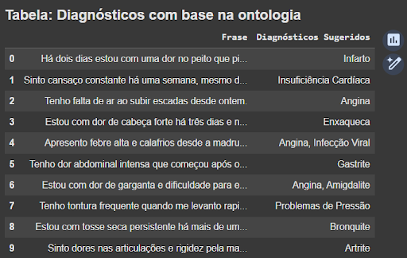
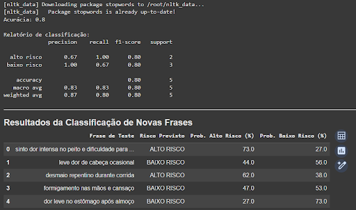

# FIAP - Faculdade de Informática e Administração Paulista

<p align="center">
<a href= "https://www.fiap.com.br/"></a>
</p>

<br>

# Fase 2: Diagnóstico Automatizado – IA no Estetoscópio Digital

### Nome do grupo
Grupo 30

## 👨‍🎓 Integrantes: 
- [Ana Beatriz Duarte Domingues](https://www.linkedin.com/in/)
  **RM**: 560302
- [Junior Rodrigues da Silva](https://www.linkedin.com/in/jrsilva051/)
  **RM**: 559451
- [Carlos Emilio Castillo Estrada](https://www.linkedin.com/in/)
  **RM**: 559855

## 👩‍🏫 Professores:
### Tutor(a)
- [Lucas Gomes Moreira](https://www.linkedin.com/company/inova-fusca)
### Coordenador(a)
- [André Godoi Chiovato](https://www.linkedin.com/company/inova-fusca)


## 📜 Descrição

Este repositório faz parte da **Fase 2: Diagnóstico Automatizado – IA no Estetoscópio Digital** do projeto **CardioIA**.  
O objetivo é simular a automatização do diagnóstico com Inteligência Artificial, utilizando **NLP (Processamento de Linguagem Natural)**, **classificação de texto** e **análise de sintomas** para propor diagnósticos assistidos por IA. 

O projeto está dividido em **duas partes principais**:
1. Extração de sintomas e associação a diagnósticos.  
2. Classificação de risco clínico (Baixo Risco / Alto Risco).

---

## 🎯 Objetivos da Fase 2

- Interpretar pequenos relatos médicos (frases de sintomas).  
- Associar sintomas a possíveis doenças com base em um mapa de conhecimento.  
- Treinar um classificador para categorizar casos em **Baixo Risco** ou **Alto Risco**.  
- Avaliar métricas de desempenho e refletir sobre governança e vieses em IA aplicada à saúde.  

---

## 📂 Estrutura do Repositório

Dentre os arquivos e pastas presentes na raiz do projeto, definem-se:

- **assets/** → imagens utilizadas na documentação do projeto.  
- **src/** → código-fonte desenvolvido para esta fase.  
  - **parte1/** → extração de sintomas e diagnósticos.  
    - `Parte_1_–_Frases_de_sintomas_+_extração_de_informações.ipynb` → Notebook da Parte 1.  
    - `sintomas.txt` → Frases simuladas de pacientes (10 relatos).  
    - `mapa_sintomas.csv` → Mapa de conhecimento relacionando sintomas e doenças.  
  - **parte2/** → classificador de risco (TF-IDF + Random Forest).  
    - `Parte_2_–_Classificador_básico_de_texto.ipynb` → Notebook da Parte 2.  
    - `frases_risco.csv` → Dataset com frases rotuladas em "alto risco" e "baixo risco".  
- **README.md** → guia geral do projeto (o arquivo que você está lendo).

---

## 🛠️ Tecnologias Utilizadas
- Linguagem Principal: Python 3.x
- Bibliotecas:
- Pandas (manipulação de dados e CSV).
- Scikit-learn (TF-IDF, Random Forest e métricas de avaliação).
- NLTK ou Unidecode (pré-processamento: minúsculas, remoção de acentos, stopwords e pontuação).
- Ambiente: Google Colab para notebooks; Jupyter Notebook para execução local; GitHub para versionamento.
- Outros: Arquivos CSV/TXT para dados simulados.

  
## 🩺 Parte 1 – Sintomas e Diagnósticos
- O sistema lê as frases do arquivo **`sintomas.txt`**.  
- Identifica palavras-chave usando o **`mapa_sintomas.csv`**.  
- Sugere diagnósticos com base em **mapeamento direto** (não supervisionado).  

**Exemplos de resultados:**  
- *"Há dois dias estou com uma dor no peito que piora quando faço esforço físico"* → **Infarto**  
- *"Tenho falta de ar ao subir escadas desde ontem"* → **Angina**  
- *"Apresento febre alta e calafrios desde a madrugada"* → **Infecção Viral**



> *Figura 1 – Resultado da sugestão de diagnóstico com base em mapeamento direto.* 

**Notebook Parte 1:** [Acesse aqui](https://colab.research.google.com/drive/1AGX4IN-DuhKycOYdWNezW_mIYzH-gTF5?usp=sharing)

---

## 🤖 Parte 2 – Classificador de Risco
Nesta parte foi desenvolvido um **classificador supervisionado** para identificar a gravidade dos casos.

### Metodologia
1. Dataset criado manualmente em **`frases_risco.csv`**.  
2. Pré-processamento: minúsculas, remoção de acentos, stopwords e pontuação.  
3. Vetorização com **TF-IDF**.  
4. Modelo treinado: **Random Forest**.  
5. Avaliação por métricas de acurácia, precisão, recall e F1-Score.  

### Resultados
- **Acurácia geral:** 80%  
- **Precisão (Alto Risco):** 67%  
- **Recall (Alto Risco):** 100% ✅  
- **Precisão (Baixo Risco):** 100%  
- **Recall (Baixo Risco):** 67%  
- **F1-Score:** 0.80 (bom equilíbrio)

**Exemplos de classificação em novas frases:**  
- *"sinto dor intensa no peito e dificuldade para respirar"* → **ALTO RISCO (≈100%)**  
- *"leve dor de cabeça ocasional"* → **BAIXO RISCO (≈100%)**  
- *"desmaio repentino durante corrida"* → **ALTO RISCO (≈99%)**  



> *Figura 2 – Relatório de classificação e classificação de novas frases.*

**Notebook Parte 2:** [Acesse aqui](https://colab.research.google.com/drive/1CEOjHqygdc5nXL0r7z5xnC_eDLujTQWh?usp=sharing)  
**Demonstração em vídeo:** [YouTube](https://youtu.be/lw3EUBUmiFI)  

---

## 📊 Análises e Conclusões
- A **Parte 1** mostrou como estruturar relatos textuais para apoiar diagnósticos simples, funcionando como uma **base de triagem clínica inicial**.  
- A **Parte 2** trouxe a aplicação de **IA supervisionada**, conseguindo **100% de recall para casos de Alto Risco** — ou seja, **nenhum caso grave deixou de ser identificado**.  
- Mesmo com **80% de acurácia geral**, o desempenho é adequado em contextos médicos, onde **é preferível classificar falsos positivos como alto risco** do que deixar de identificar emergências.  
- Conclusão: o projeto demonstra que, com técnicas acessíveis de NLP e Machine Learning, é possível **simular sistemas de apoio à decisão médica**, aproximando-se da lógica de soluções usadas em hospitais e clínicas.  

---

## 🚀 Como Executar

1. **No Google Colab (Recomendado)**:  
   - Acesse os links dos notebooks.  
   - Faça upload dos arquivos `sintomas.txt`, `mapa_sintomas.csv` e `frases_risco.csv` via menu "Arquivos" no Colab (arraste e solte ou use o botão de upload).  
   - Execute as células sequencialmente para visualizar:  
     - Parte 1 → Extração de sintomas e diagnósticos.  
     - Parte 2 → Treinamento e avaliação do classificador (insira frases de teste para prever risco).  

2. **Localmente (Opcional)**:  
   - Clone o repositório:  
     ```bash
     git clone https://github.com/seu-usuario/cardioia-fase2.git
     cd cardioia-fase2
     ```  
   - Instale dependências:  
     ```bash
     pip install -r requirements.txt
     ```  
   - Execute os notebooks:  
     ```bash
     jupyter notebook
     ```  
     Abra `Parte_1_–_Frases_de_sintomas_+_extração_de_informações.ipynb` e `Parte_2_–_Classificador_básico_de_texto.ipynb`.  

---

## ✨ Ir Além 1 – Interface do CardioIA
O projeto também conta com uma interface web desenvolvida em **React + Vite**, que simula a visualização de pacientes, agendamentos e métricas simples.

Confira o repositório aqui: [cardioia-portal](https://github.com/Jr-RS/grupo-30-cardioia-portal.git)

---

## Histórico de lançamentos

* 0.1.0 - 29/09/2025
    * Primeira versão do projeto.

## Licença

<p xmlns:cc="http://creativecommons.org/ns#" xmlns:dct="http://purl.org/dc/terms/"><a property="dct:title" rel="cc:attributionURL" href="https://github.com/agodoi/template">MODELO GIT FIAP</a> por <a rel="cc:attributionURL dct:creator" property="cc:attributionName" href="https://fiap.com.br">Fiap</a> está licenciado sobre <a href="http://creativecommons.org/licenses/by/4.0/?ref=chooser-v1" target="_blank" rel="license noopener noreferrer" style="display:inline-block;">Attribution 4.0 International</a>.</p>


